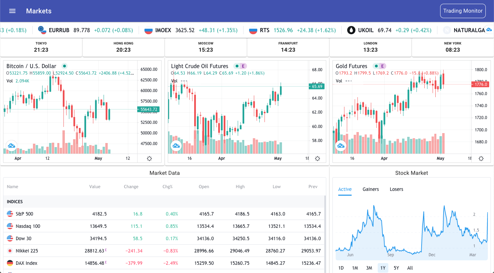
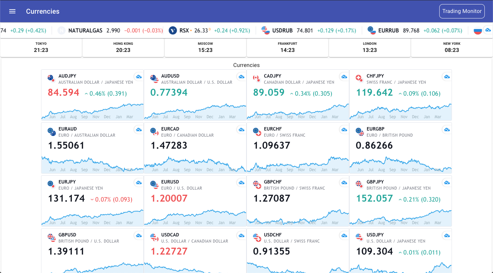
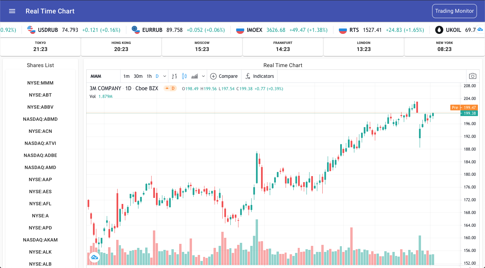
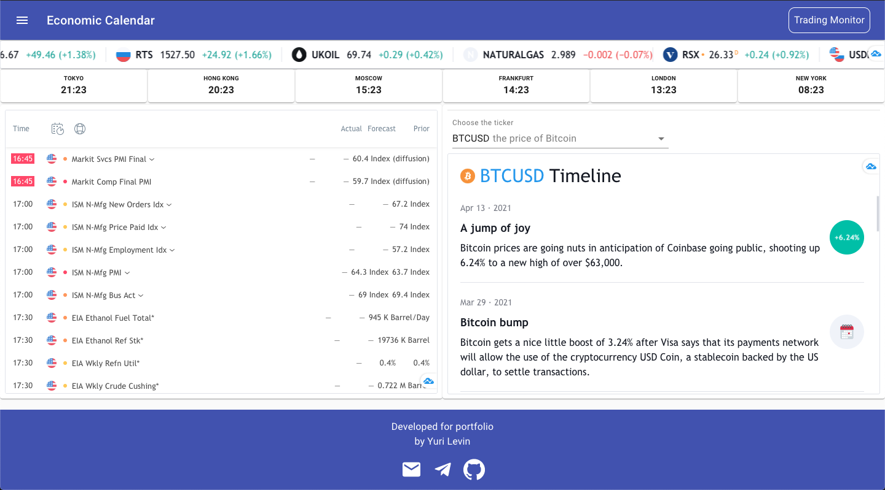

# Trading Monitor на ReactJS с использованием [Tradingview Widgets](https://www.tradingview.com/widget/)

## Что и зачем

Тестовый проект на адаптацию виджетов открытого API [Tradingview](https://www.tradingview.com/) при компонентном подходе.

## Настройка сборки {[Create React App](https://github.com/facebook/create-react-app)}

- create-react-app --template typescript 

## Что использовалось

- [Material-UI](https://material-ui.com/)
- [ReactJS](https://reactjs.org/)
- [Typescript](https://www.typescriptlang.org/)
- [Redux/React-Redux](https://react-redux.js.org/)

## Стандартные скрипты

### `npm i`

Установка зависимостей.

### `npm start`

Запуск приложения в режиме разработки.

### `npm test`

Запуск тестов.

### `npm run build`

Сборка приложения на продакшн.

## Скриншоты

### Компонент Markets

### Компонент Currencies

### Компонент Real Time Chart

### Компонент Economic Calendar

